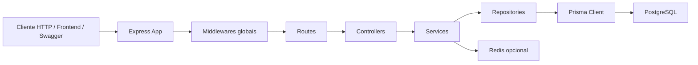
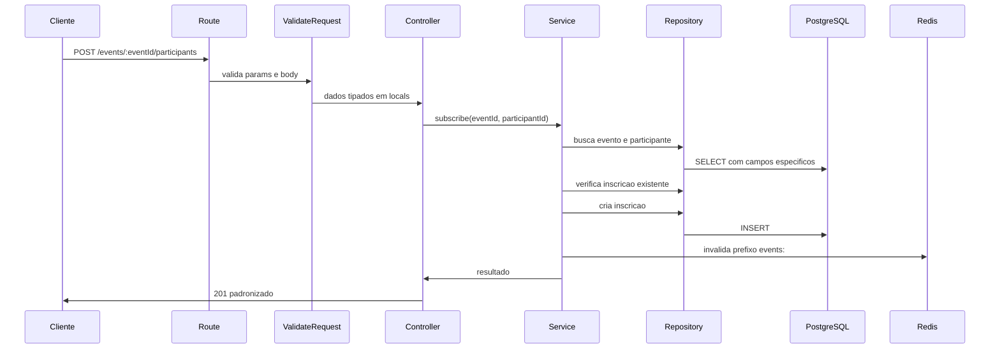

# Arquitetura

## Objetivo deste capitulo

Este capitulo descreve como o backend foi organizado internamente: camadas,
modulos, fluxo de uma request, dependencias transversais e pontos de extensao.

O objetivo e permitir que um avaliador entenda rapidamente onde cada
responsabilidade vive e como a API processa uma chamada do inicio ao fim.

## Visao geral

Em alto nivel, o backend e composto por:

- cliente HTTP, Swagger ou frontend;
- aplicacao Express;
- middlewares compartilhados;
- modulos de dominio;
- repositories com Prisma;
- PostgreSQL;
- Redis opcional.



## Principio estrutural

A arquitetura segue separacao por responsabilidade:

- routes mapeiam endpoints e middlewares de validacao;
- controllers lidam com request e response;
- services concentram regras de negocio;
- repositories fazem acesso ao banco;
- infrastructure encapsula banco e cache;
- shared concentra contratos e utilitarios reutilizaveis.

Essa separacao deixa o fluxo mais facil de testar e evita que regra de negocio
fique acoplada ao Express ou ao Prisma.

## Estrutura principal

```text
backend/
  prisma/
  scripts/
  src/
    infrastructure/
    modules/
      events/
      participants/
    shared/
    index.ts
    server.ts
  tests/
```

## Bootstrap da aplicacao

O arquivo `src/index.ts` e pequeno e delega a inicializacao para `src/server.ts`.

O `server.ts` e responsavel por:

- criar a aplicacao Express;
- registrar middlewares globais;
- registrar Swagger;
- registrar health checks;
- registrar rotas de dominio;
- registrar handlers de erro;
- abrir conexoes com banco e cache;
- configurar shutdown gracioso.

## Middlewares globais

Os middlewares globais sao registrados antes das rotas de dominio:

- `requestContext`: adiciona ou propaga `X-Request-Id`;
- `pino-http`: gera logs HTTP estruturados;
- `rateLimit`: protege contra excesso de requisicoes;
- `helmet`: adiciona headers de seguranca;
- `cors`: controla origens permitidas;
- body parsers do Express;
- Swagger em `/docs` e `/docs.json`;
- `responseFormatter`: adiciona helpers de resposta;
- rotas protegidas;
- `notFoundHandler`;
- `errorHandler`.

## Rotas de dominio

As rotas de dominio sao registradas em `src/shared/routes/index.ts`.

Antes de entrar em `/events` e `/participants`, a API aplica
`authenticateApiToken`. Com isso, health checks e documentacao permanecem
publicos, mas as operacoes de dominio exigem token.

## Modulo events

O modulo `events` possui:

```text
src/modules/events/
  controllers/
  docs/
  repositories/
  routes/
  schemas/
  services/
  types/
```

Ele concentra:

- criacao de eventos;
- listagem de eventos;
- busca por id;
- exclusao;
- inscricao de participante;
- listagem de participantes de um evento.

## Modulo participants

O modulo `participants` possui a mesma estrutura:

```text
src/modules/participants/
  controllers/
  docs/
  repositories/
  routes/
  schemas/
  services/
  types/
```

Ele concentra:

- criacao de participantes;
- listagem de participantes;
- exclusao;
- verificacao de e-mail duplicado.

## Fluxo de uma request

Exemplo: `POST /events/:eventId/participants`.



## Shared

`src/shared` concentra:

- config de ambiente e Swagger;
- erros HTTP customizados;
- middlewares;
- schemas compartilhados, como paginacao;
- tipos compartilhados;
- utilitarios de data, logger e paginacao.

Essa camada existe para evitar duplicacao e manter consistencia entre os
modulos.

## Infrastructure

`src/infrastructure` concentra integracoes tecnicas:

- Prisma e conexao com PostgreSQL;
- mapeamento de erros do Prisma;
- Redis cache opcional.

Essa camada nao deve conter regra funcional de eventos ou participantes. Ela
oferece recursos para os modulos.

## Pontos de extensao

A estrutura permite evoluir com baixo atrito:

- adicionar novo modulo em `src/modules`;
- adicionar novos endpoints por modulo;
- criar novos schemas Zod para contratos;
- adicionar novas migrations Prisma;
- ampliar estrategia de cache;
- adicionar novos testes unitarios e HTTP sem reestruturar a aplicacao.
