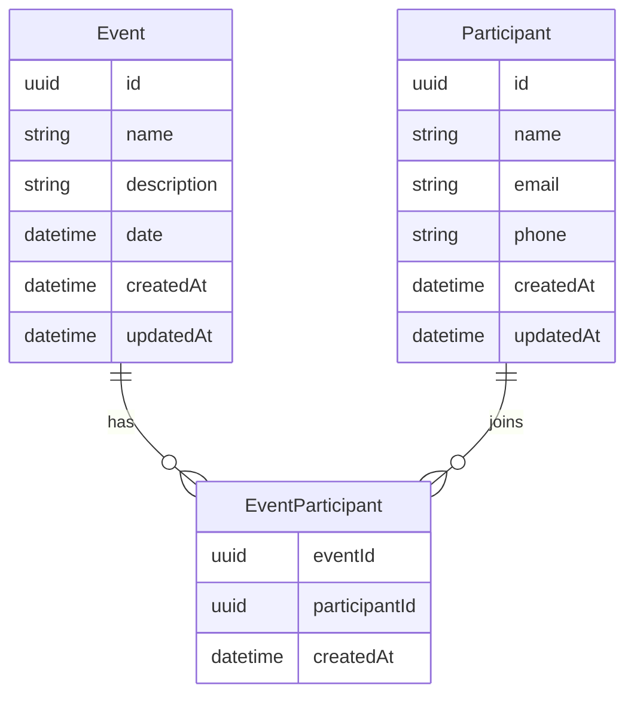

# Dados, Cache e Prisma

## Objetivo deste capitulo

Este capitulo descreve a modelagem de dados, as migrations, os indices, a
estrategia de cache e o seed do backend.

## Banco de dados

O backend usa PostgreSQL com Prisma. A modelagem esta em
`prisma/schema.prisma`, e as migrations ficam em `prisma/migrations`.

Os modelos principais sao:

- `Event`;
- `Participant`;
- `EventParticipant`.

## Modelo Event

`Event` representa um evento cadastravel na API.

Campos principais:

- `id`: UUID;
- `name`: nome do evento;
- `description`: descricao;
- `date`: data do evento;
- `createdAt`: data de criacao;
- `updatedAt`: data de atualizacao.

Indices:

- `date`;
- `name`;
- `createdAt`.

Esses indices apoiam listagens e ordenacoes comuns.

## Modelo Participant

`Participant` representa uma pessoa que pode ser inscrita em eventos.

Campos principais:

- `id`: UUID;
- `name`: nome;
- `email`: e-mail unico;
- `phone`: telefone;
- `createdAt`;
- `updatedAt`.

Indices:

- `name`;
- `createdAt`.

O campo `email` possui restricao unica. A API tambem normaliza e-mail para
lowercase antes de persistir.

## Modelo EventParticipant

`EventParticipant` representa a inscricao de um participante em um evento.

Campos principais:

- `eventId`;
- `participantId`;
- `createdAt`.

A chave primaria e composta por `eventId` e `participantId`, impedindo que o
mesmo participante seja inscrito duas vezes no mesmo evento.

As relacoes usam `onDelete: Cascade`, entao excluir um evento ou participante
remove as inscricoes relacionadas.

## Diagrama relacional



## Migrations

As migrations versionadas criam e evoluem o banco:

- `20260608155000_init_events_participants`;
- `20260609195128_add_query_indexes`.

Em desenvolvimento, use:

```bash
npm run db:migrate
```

Em producao ou Docker, use:

```bash
npm run db:deploy
```

## Prisma Client

O Prisma Client e gerado em:

```text
src/generated/prisma
```

Esse caminho evita depender de geracao dentro de `node_modules` e deixa o
client explicito no build.

Comando:

```bash
npm run db:generate
```

## Selects explicitos

Os repositories usam `select` para buscar apenas os campos necessarios.

Essa decisao evita:

- trafego desnecessario entre API e banco;
- dependencia acidental de campos internos;
- retorno de informacoes que nao fazem parte do contrato.

## Tratamento de erros do Prisma

Erros conhecidos do Prisma sao convertidos para erros HTTP mais claros.

Exemplos:

- violacao de unique vira conflito `409`;
- registro inexistente vira `404`;
- violacao de chave estrangeira vira erro coerente com a regra envolvida.

Esse mapeamento evita que mensagens internas do ORM vazem para a API.

## Cache Redis

Redis e usado para cache de leituras. A implementacao fica em:

```text
src/infrastructure/cache/redis
```

O cache e opcional:

- se `REDIS_URL` nao existir, a API segue sem cache;
- se o Redis estiver indisponivel, a API registra aviso e continua funcionando;
- erros de leitura, escrita ou invalidacao de cache nao derrubam a request.

## TTL

O TTL e configurado por:

```text
CACHE_TTL_SECONDS
```

O valor padrao e `60` segundos.

## Chaves de cache

Exemplos de chaves:

```text
events:list:page=1:limit=20:search=:sort=date:order=desc
events:detail:<eventId>
events:<eventId>:participants:page=1:limit=20:search=:sort=createdAt:order=desc
participants:list:page=1:limit=20:search=:sort=name:order=desc
```

As chaves incluem os parametros de listagem para evitar colisao entre filtros,
paginas e ordenacoes diferentes.

## Invalidacao

Invalidacoes por prefixo:

| Acao                             | Prefixos invalidados       |
| -------------------------------- | -------------------------- |
| Criar evento                     | `events:`                  |
| Excluir evento                   | `events:`                  |
| Criar participante               | `participants:`            |
| Excluir participante             | `participants:`, `events:` |
| Inscrever participante em evento | `events:`                  |

Excluir participante invalida tambem `events:` porque listagens de
participantes por evento podem mudar.

## Seed

O seed fica em:

```text
prisma/seed.ts
```

Ele usa Faker para gerar massa de teste e cria:

- eventos de exemplo;
- participantes fake;
- pelo menos um evento com 1000 participantes inscritos.

Comando:

```bash
npm run db:seed
```

No deploy, o seed pode ser habilitado por:

```text
RUN_SEED_ON_DEPLOY=true
```

Essa opcao e util para ambiente de demonstracao, mas deve ser avaliada com
cuidado em producao real.
