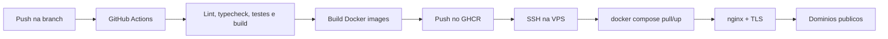

# Deploy e Operacao

## Objetivo deste capitulo

Este capitulo descreve como o backend participa do deploy com Docker, GitHub
Actions, GHCR, VPS, nginx e certbot. O foco e documentar a operacao da API em
ambientes `development` e `production`.

## Modelo de deploy

O deploy segue este fluxo:



As imagens sao buildadas no GitHub Actions e publicadas no GHCR. A VPS apenas
baixa as imagens e sobe os containers.

## Ambientes

O workflow diferencia ambientes por branch:

| Branch        | Environment   | Uso                  |
| ------------- | ------------- | -------------------- |
| `development` | `development` | Homologacao e testes |
| `main`        | `production`  | Producao             |

O workflow tambem aceita `workflow_dispatch`, respeitando a regra de que
production deve vir da branch `main` e development da branch `development`.

## Dockerfile do backend

O `backend/Dockerfile` usa multi-stage build:

- stage `build`: instala dependencias, gera Prisma Client e compila TypeScript;
- stage `runner`: instala dependencias de runtime, copia `dist`, Prisma,
  Prisma Client gerado e roda como usuario nao-root.

O container expoe a porta interna `3333`.

## Docker Compose local

O `docker-compose.yml` da raiz permite subir:

- PostgreSQL;
- Redis;
- backend;
- frontend.

No ambiente local, PostgreSQL e Redis expoem portas para facilitar
desenvolvimento.

## Docker Compose da VPS

O arquivo `deploy/docker-compose.vps.yml` e usado no servidor.

Na VPS:

- PostgreSQL nao expoe porta publica;
- Redis nao expoe porta publica;
- backend e frontend sao publicados apenas em `127.0.0.1`;
- nginx faz proxy reverso para as portas locais.

Isso reduz a superficie exposta publicamente.

## Variaveis principais do backend

O workflow gera `.env.backend` na VPS com:

```text
NODE_ENV=production
PORT=3333
HOST=0.0.0.0
BASE_URL=https://api.seudominio.com
ALLOWED_ORIGINS=https://seudominio.com
API_TOKEN=<secret>
DATABASE_URL=<secret ou montada pelo workflow>
REDIS_URL=redis://redis:6379
CACHE_TTL_SECONDS=60
RUN_SEED_ON_DEPLOY=false
```

## BASE_URL e Swagger

`BASE_URL` controla a URL exibida em `servers` no Swagger.

No deploy, se `BASE_URL` nao for configurado como var do GitHub Environment, o
workflow usa:

```text
https://${BACKEND_DOMAIN}
```

Assim o Swagger em producao ou development aponta para a API publica correta,
e nao para `localhost`.

## Seed no deploy

O deploy pode rodar seed automaticamente quando:

```text
RUN_SEED_ON_DEPLOY=true
```

O comando do backend executa:

```bash
npm run db:deploy
npm run db:seed
npm start
```

O seed automatico e util para ambiente de demonstracao. Em producao real, o
valor recomendado e `false`, a menos que a massa fake seja parte intencional da
entrega.

## Health checks

O container backend possui healthcheck interno:

```text
GET http://127.0.0.1:3333/health
```

A API tambem expoe:

- `/livez`, para processo vivo;
- `/readyz`, para prontidao e banco conectado;
- `/health`, para status geral.

## nginx e certbot

O deploy prepara configuracoes nginx para:

- dominio do frontend;
- dominio do backend;
- proxy para portas locais;
- headers `Host`, `X-Real-IP` e `X-Forwarded-*`;
- emissao de certificado TLS com certbot quando necessario.

O script e idempotente: atualiza a configuracao do projeto sem apagar
configuracoes de outros projetos.

## Secrets e vars

Secrets principais:

```text
VPS_HOST
VPS_USER
VPS_SSH_KEY
API_TOKEN
POSTGRES_PASSWORD
```

Vars principais:

```text
DEPLOY_PATH
COMPOSE_PROJECT_NAME
FRONTEND_DOMAIN
BACKEND_DOMAIN
FRONTEND_PORT
BACKEND_PORT
FRONTEND_PUBLIC_URL
ALLOWED_ORIGINS
RUN_SEED_ON_DEPLOY
```

## Operacao basica na VPS

Entrando na VPS, a pasta do deploy fica em `DEPLOY_PATH`.

Comandos uteis:

```bash
docker compose ps
docker compose logs -f backend
docker compose logs -f postgres
docker compose logs -f redis
```

Para verificar a API:

```bash
curl https://api-case-eventos-dev.cledson.com.br/health
curl https://api-case-eventos-dev.cledson.com.br/docs.json
```

## Rollback

O modelo publica imagens com tag por SHA e tag por ambiente. Um rollback pode
ser feito apontando `BACKEND_IMAGE` para uma tag anterior e rodando novamente:

```bash
docker compose pull
docker compose up -d
```

Como as migrations sao aplicadas no deploy, qualquer rollback que envolva
mudanca de schema precisa considerar compatibilidade do banco.
