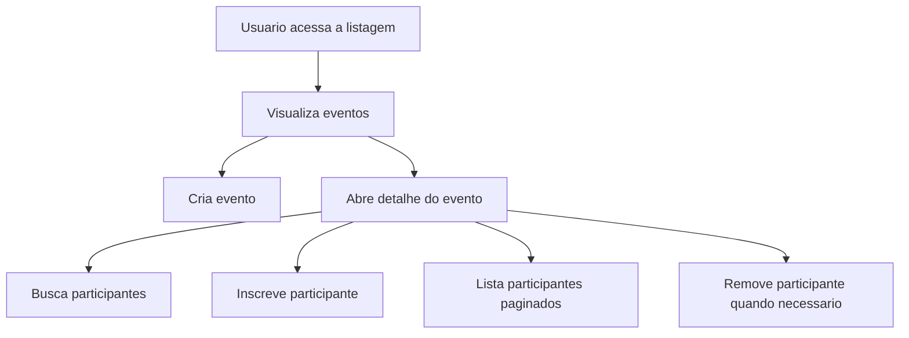
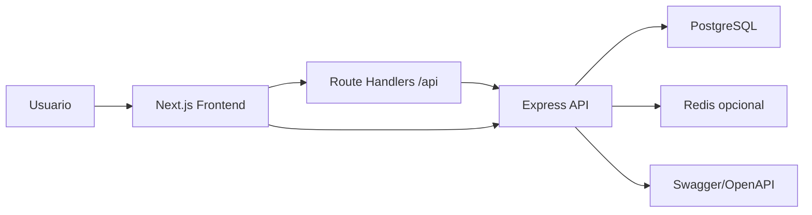

# Visao Geral da Solucao

## Objetivo deste capitulo

Este capitulo descreve a solucao completa em alto nivel: dominios, fluxos,
componentes principais e responsabilidades de cada parte.

## Dominios

O sistema trabalha com tres conceitos principais:

- evento;
- participante;
- inscricao de participante em evento.

No backend, esses conceitos sao modelados como:

- `Event`;
- `Participant`;
- `EventParticipant`.

No frontend, os mesmos conceitos aparecem como tipos em `frontend/src/types`.

## Fluxo funcional

O fluxo principal e:



## Componentes de sistema



## Backend

O backend expoe API REST protegida por Bearer token nas rotas de dominio. Ele
usa Express, Prisma, PostgreSQL, Redis opcional, Swagger, Pino, Zod e Vitest.

Responsabilidades:

- validar entradas;
- aplicar regras de negocio;
- persistir dados;
- invalidar cache;
- responder em formato padronizado;
- documentar contratos;
- fornecer health checks.

## Frontend

O frontend entrega a interface web com Next.js, React, TypeScript, Tailwind CSS
e Axios.

Responsabilidades:

- listar eventos;
- exibir detalhes;
- enviar formularios;
- mostrar feedback;
- manter token fora do browser;
- tratar loading, erro e vazio;
- preservar filtros e paginacao.

## Banco

PostgreSQL armazena:

- eventos;
- participantes;
- relacao entre evento e participante.

A relacao de inscricao usa chave composta para impedir duplicidade no nivel do
banco.

## Cache

Redis e usado como cache opcional para leituras. Se Redis estiver indisponivel,
a API continua funcionando sem cache.

Essa escolha melhora resiliencia e evita que uma dependencia auxiliar derrube
o fluxo principal.

## Deploy

O projeto possui Dockerfile para backend e frontend, compose local e compose de
VPS.

O deploy usa:

- GitHub Actions;
- GHCR;
- SSH na VPS;
- Docker Compose;
- nginx;
- certbot.

## Documentacao

As documentacoes estao separadas por nivel:

```text
docs/          documentacao geral fullstack
backend/docs/  documentacao tecnica do backend
frontend/docs/ documentacao tecnica do frontend
README.md      setup resumido
```

## Resultado

A solucao entrega uma experiencia completa: o avaliador pode rodar o projeto,
testar a API no Swagger, navegar no frontend, ver o banco com dados seedados,
executar testes e entender a arquitetura pelas documentacoes.
