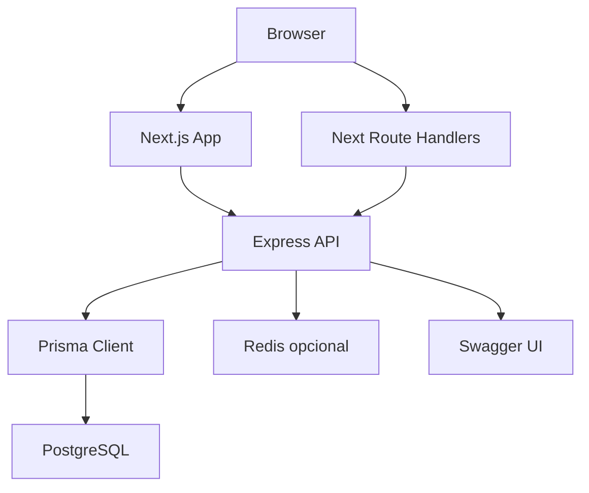
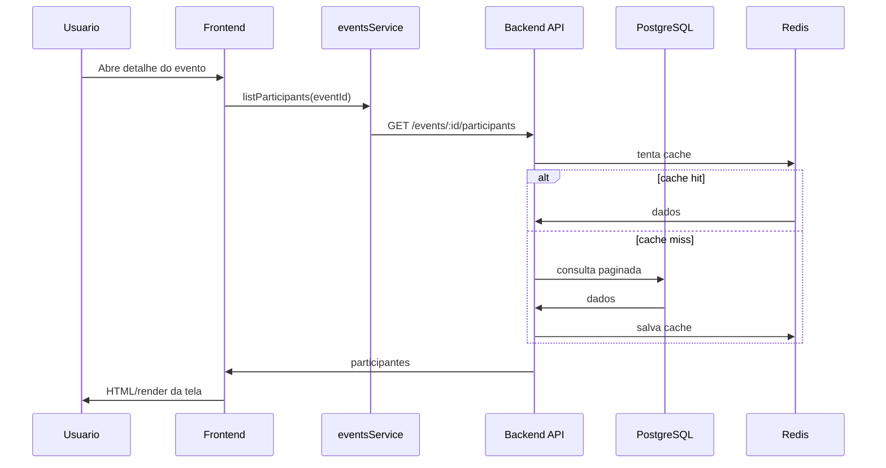
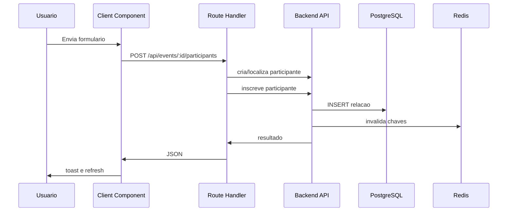

# Arquitetura Fullstack

## Objetivo deste capitulo

Este capitulo detalha a arquitetura fullstack do projeto e como backend,
frontend, banco, cache e deploy se conectam.

## Visao geral



## Separacao entre frontend e backend

Backend e frontend ficam em pastas independentes:

```text
backend/
frontend/
```

Cada aplicacao possui:

- `package.json`;
- scripts proprios;
- Dockerfile proprio;
- `.env.example`;
- documentacao tecnica propria.

Essa separacao permite rodar apenas uma parte quando necessario, mas tambem
subir tudo pelo compose da raiz.

## Contrato HTTP

O frontend consome o backend via HTTP. O backend responde com envelope
padronizado:

```json
{
  "success": true,
  "message": "Operacao realizada com sucesso",
  "data": {},
  "timestamp": "2026-06-09T12:00:00.000Z"
}
```

No frontend, `httpClient` remove o envelope e entrega apenas `data` aos
services.

## Seguranca do token

O backend protege rotas de dominio com Bearer token.

O frontend nao expoe esse token ao browser. Leituras server-side e Route
Handlers internos injetam o header:

```text
Authorization: Bearer <API_TOKEN>
```

## Fluxo de leitura

Exemplo: listar participantes de um evento.



## Fluxo de escrita

Exemplo: inscrever participante pelo frontend.



## Camadas do backend

O backend usa camadas explicitas:

- routes;
- middlewares de validacao;
- controllers;
- services;
- repositories;
- infrastructure;
- shared.

Essa estrutura reduz acoplamento entre Express, regra de negocio e Prisma.

## Camadas do frontend

O frontend usa:

- pages e layouts;
- Server Components;
- Client Components;
- Route Handlers;
- services;
- hooks;
- utils;
- components compartilhados.

Essa estrutura evita que regra de chamada HTTP fique espalhada em componentes.

## Infraestrutura local

`docker-compose.yml` na raiz sobe:

- PostgreSQL;
- Redis;
- backend;
- frontend.

Tambem permite subir apenas backend ou apenas frontend, conforme a necessidade.

## Infraestrutura de producao

O deploy em VPS usa outro compose em `deploy/docker-compose.vps.yml`.

Nesse modelo:

- imagens sao buildadas no GitHub Actions;
- imagens sao publicadas no GHCR;
- VPS apenas faz pull e sobe containers;
- nginx publica dominios;
- certbot gerencia HTTPS.

## Pontos de extensao

A arquitetura permite evoluir com:

- autenticacao de usuario;
- edicao de eventos;
- filtros avancados;
- auditoria;
- dashboard;
- multi-tenant;
- filas ou jobs;
- novas telas ou modulos.

Essas extensoes nao foram implementadas porque o case pede uma solucao simples.
