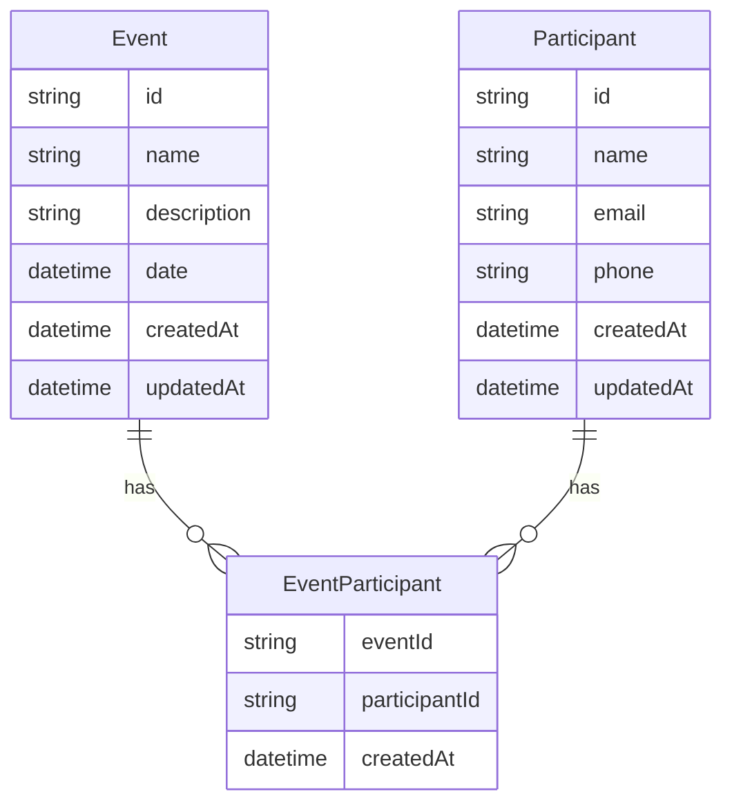

# Dados, Cache e Integracoes

## Objetivo deste capitulo

Este capitulo descreve como dados fluem pelo projeto, como o banco foi
modelado, onde o cache entra e quais integracoes existem entre as partes.

## Modelo de dados

O sistema possui tres entidades principais:



## PostgreSQL

PostgreSQL foi usado por ser requisito do teste e por representar bem a relacao
muitos-para-muitos entre eventos e participantes.

As migrations sao versionadas pelo Prisma e ficam em:

```text
backend/prisma/migrations
```

## Prisma

Prisma e usado para:

- schema;
- migrations;
- client tipado;
- consultas com selects explicitos.

O projeto evita buscar todos os campos automaticamente quando a consulta precisa
de um formato especifico.

## Seed

O seed usa dados fake para facilitar teste manual e demonstracao.

Ele cria:

- eventos de exemplo;
- participantes de exemplo;
- um evento com 1000 participantes.

Esse volume ajuda a validar paginacao e performance.

## Cache Redis

Redis cacheia respostas de leitura, como:

- listagem de eventos;
- detalhe de evento;
- listagem de participantes.

O cache tem TTL configuravel por:

```env
CACHE_TTL_SECONDS=60
```

## Cache opcional

Redis nao e dependencia obrigatoria para a API funcionar.

Se Redis falhar, a aplicacao segue consultando o banco. Essa decisao favorece
resiliencia.

## Invalidacao

Operacoes de escrita invalidam chaves relacionadas:

- criacao de evento;
- exclusao de evento;
- criacao de participante;
- exclusao de participante;
- inscricao de participante em evento.

## Integracao backend-frontend

O frontend usa Axios para chamar a API. O token fica server-side.

Leituras:

- Server Components chamam services;
- services chamam `httpClient`;
- `httpClient` chama backend.

Escritas:

- Client Components chamam `/api` do Next;
- Route Handlers chamam services;
- services chamam backend.

## Integracao Swagger

Swagger documenta a API do backend em:

```text
/docs
/docs.json
```

Essa integracao permite testar contratos sem depender do frontend.

## Integracao Docker

No compose local:

- backend acessa Postgres por `postgres:5432`;
- backend acessa Redis por `redis:6379`;
- frontend acessa backend por `http://backend:3333` quando em container.

No host local, as portas ficam expostas para facilitar desenvolvimento.
