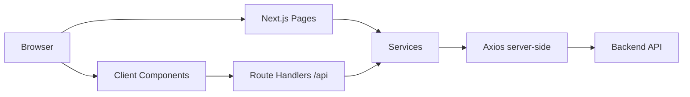
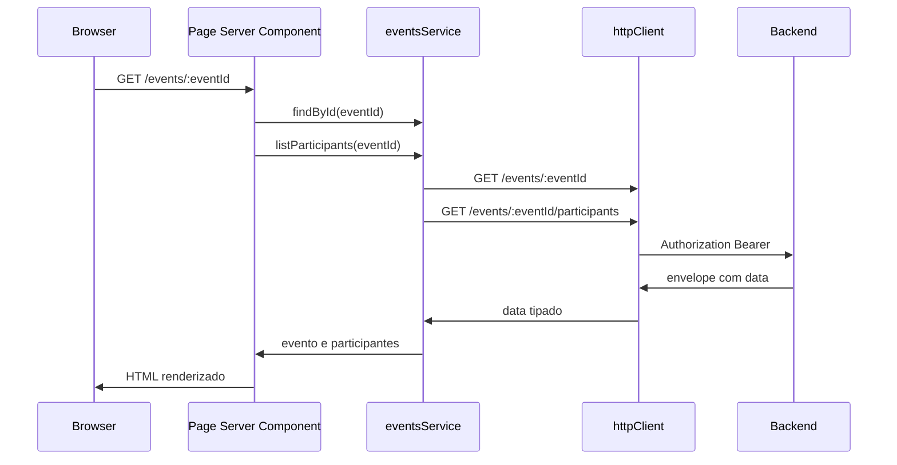
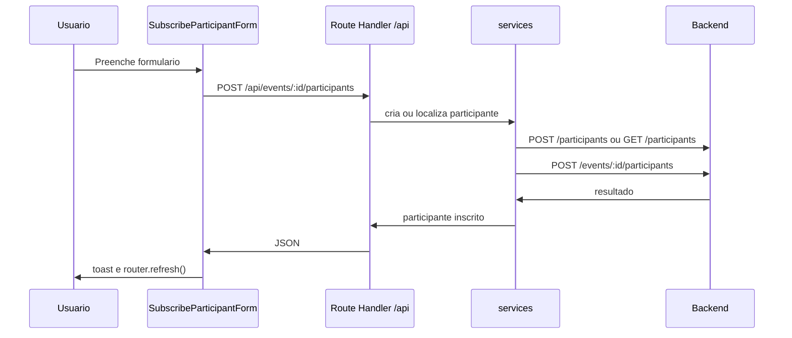

# Arquitetura

## Objetivo deste capitulo

Este capitulo descreve como o frontend foi organizado internamente: rotas,
componentes, servicos, BFF, estado local e fluxo de dados.

O objetivo e permitir que um avaliador entenda rapidamente onde cada
responsabilidade vive e como a tela se conecta ao backend.

## Visao geral

Em alto nivel, o frontend e composto por:

- paginas Next.js;
- Server Components para leitura;
- Client Components para interacao;
- Route Handlers como BFF;
- camada de servicos;
- cliente Axios server-side;
- backend Express.



## Principio estrutural

A arquitetura segue separacao por responsabilidade:

- paginas orquestram dados e layout;
- componentes de rota cuidam de partes especificas da tela;
- componentes compartilhados ficam em `src/components`;
- servicos acessam a API;
- Route Handlers recebem chamadas do browser;
- utilitarios concentram data, erro, mascara e validacao.

## Estrutura principal

```text
frontend/
  src/
    app/
      api/
      events/
        [eventId]/
        new/
      layout.tsx
      page.tsx
    components/
      layout/
      providers/
      ui/
    config/
    hooks/
    lib/
    services/
    types/
    utils/
```

## App Router

As rotas principais vivem em `src/app`:

```text
src/app/
  page.tsx
  events/
    page.tsx
    loading.tsx
    error.tsx
    new/
      page.tsx
    [eventId]/
      page.tsx
      loading.tsx
```

Cada rota pode declarar seus proprios estados de loading e erro, deixando a
experiencia mais previsivel.

## Server Components

As paginas usam Server Components para buscar dados:

- `/` busca proximos eventos;
- `/events` busca eventos paginados;
- `/events/:eventId` busca evento e participantes em paralelo.

Como a busca ocorre no servidor, `API_TOKEN` nao vai para o bundle do browser.

## Client Components

Client Components sao usados apenas onde ha interacao:

- `CreateEventForm`;
- `SubscribeParticipantForm`;
- `DeleteParticipantAction`;
- `ParticipantContactValue`;
- `ThemeToggle`;
- `ToastProvider`.

Essa separacao evita transformar a aplicacao inteira em client-side sem
necessidade.

## Route Handlers

Os Route Handlers em `src/app/api` atuam como BFF:

```text
src/app/api/
  events/
    route.ts
    [eventId]/
      participants/
        route.ts
  participants/
    [participantId]/
      route.ts
```

Eles recebem dados do browser, chamam os servicos server-side e retornam JSON
com status adequado.

## Camada de servicos

Os servicos ficam em `src/services`:

- `events.ts`;
- `participants.ts`.

Eles conhecem os endpoints do backend, mas nao conhecem componentes React.
Isso permite reutilizar as chamadas em paginas e Route Handlers.

## Cliente HTTP

`src/lib/http.ts` centraliza Axios:

- `baseURL` vem de `API_URL`;
- `Authorization` usa `API_TOKEN`;
- timeout padrao de 10 segundos;
- resposta da API e desempacotada para retornar apenas `data`.

## Fluxo de leitura

Exemplo: abrir `/events/:eventId`.



## Fluxo de escrita

Exemplo: inscrever participante.



## Pontos de extensao

A estrutura permite evoluir com baixo atrito:

- adicionar novas telas em `src/app`;
- adicionar novos componentes especificos por rota;
- criar novos Route Handlers quando houver submissao client-side;
- ampliar servicos sem acoplar ao React;
- adicionar novos testes de comportamento.
